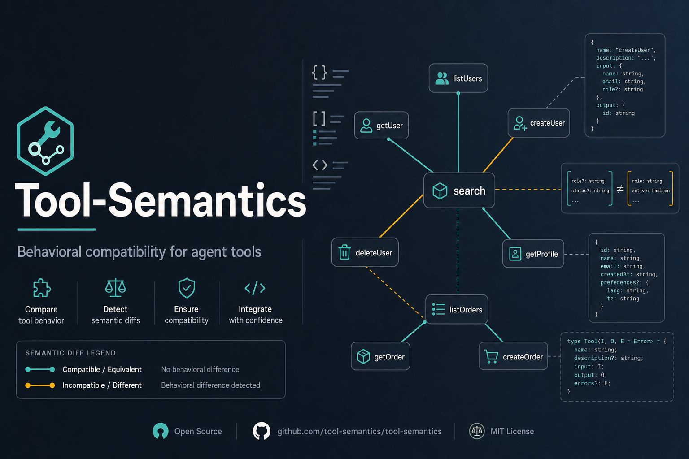
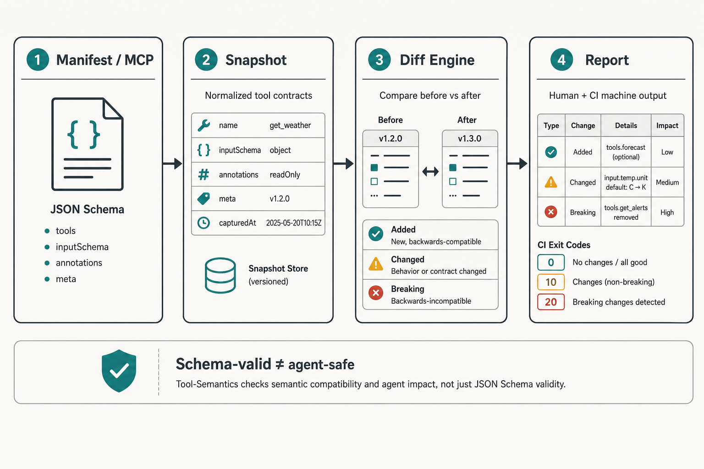
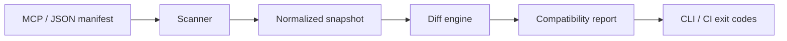
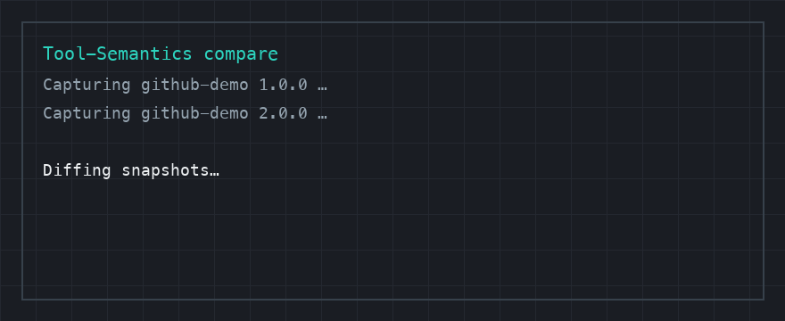

<p align="center">
  
</p>

<h1 align="center">Tool-Semantics</h1>

<p align="center">
  <strong>Know when an MCP change breaks the agent — not just the schema.</strong>
</p>

<p align="center">
  Behavioral compatibility testing for MCP tools and AI-agent interfaces.
</p>

<p align="center">
  <a href="https://github.com/askmy-stack/Tool-Semantics/actions/workflows/ci.yml"></a>
  <a href="https://www.python.org/downloads/"></a>
  <a href="LICENSE"></a>
  <a href="https://github.com/askmy-stack/Tool-Semantics/issues?q=is%3Aissue+is%3Aopen+label%3A%22good+first+issue%22"></a>
</p>

---

## Why Tool-Semantics?

AI agents do not call tools the way typed clients do. They choose tools from **descriptions**, invent **arguments** from schemas, and infer **side effects** from naming and prose. A change that remains JSON-Schema-valid can still:

- steer the model toward the wrong tool
- drop a required argument the model used to omit
- rename enums the model still emits
- quietly escalate from read-only to write/destructive behavior

**Tool-Semantics** captures normalized tool-interface snapshots and diffs them for structural *and* semantic risk — so teams can gate MCP and tool-API changes before agents ship broken workflows.

## Compatibility layers

| Layer | Question |
| --- | --- |
| 1. Protocol | Can the client still speak to the server? |
| 2. Schema | Are parameters and types still valid? |
| 3. Tool selection | Will models still pick the right tool? |
| 4. Execution | Do calls still succeed with prior argument patterns? |
| 5. Intent / side effects | Did risk, confirmation needs, or outcomes change? |

The MVP implements deterministic interface snapshots and structural comparison (layers 1–2, with warnings that point at 3–5). Live MCP capture and model-based behavioral testing are on the [roadmap](ROADMAP.md).

## How it works

<p align="center">
  
</p>

<p align="center">
  
</p>



## Quick start

```bash
python -m venv .venv
source .venv/bin/activate
pip install -e ".[dev]"

# Capture two interface versions
tool-semantics capture examples/github_server_v1.json -o .tool-semantics/v1.json
tool-semantics capture examples/github_server_v2.json -o .tool-semantics/v2.json

# Compare — exits 1 on breaking/critical changes
tool-semantics compare .tool-semantics/v1.json .tool-semantics/v2.json \
  --markdown-output .tool-semantics/report.md
```

### Demo

<p align="center">
  
</p>

### Example output

Comparing the included GitHub demo manifests surfaces removals, renames via addition, description drift, and newly required parameters:

```text
Tool-Semantics: 1.0.0 → 2.0.0
┌──────────┬────────────────────────────┬─────────────────────────┬──────────────────────────────────────────┐
│ Severity │ Code                       │ Subject                 │ Change                                   │
├──────────┼────────────────────────────┼─────────────────────────┼──────────────────────────────────────────┤
│ breaking │ tool.removed               │ search_issues           │ Tool 'search_issues' was removed.        │
│ info     │ tool.added                 │ find_work_items         │ Tool 'find_work_items' was added; …      │
│ warning  │ tool.description_changed   │ create_issue            │ Tool description changed; …              │
│ breaking │ parameter.added_required   │ create_issue.repository │ Required parameter 'repository' was …    │
└──────────┴────────────────────────────┴─────────────────────────┴──────────────────────────────────────────┘
Result: breaking
```

## Install (library)

```bash
pip install -e .
# later: pip install tool-semantics
```

```python
from pathlib import Path
from tool_semantics.scanner import capture_manifest
from tool_semantics.diff import compare_snapshots
from tool_semantics.report import render_markdown

baseline = capture_manifest(Path("examples/github_server_v1.json"))
candidate = capture_manifest(Path("examples/github_server_v2.json"))
report = compare_snapshots(baseline, candidate)
print(render_markdown(report))
print("compatible:", report.is_compatible)
```

## Exit codes

| Code | Meaning |
| --- | --- |
| `0` | Compatible (no breaking/critical changes) |
| `1` | Breaking or critical changes detected |
| `2` | Input / capture / parse error |

## CLI reference

```bash
tool-semantics --version
tool-semantics capture <manifest.json> [-o .tool-semantics/snapshot.json] [-v]
tool-semantics compare <baseline.json> <candidate.json> \
  [--json-output report.json] \
  [--markdown-output report.md] \
  [--config .tool-semantics.toml] \
  [-v]
```

- `--verbose` / `-v` logs paths, tool counts, and change totals to **stderr** (default Rich UX unchanged).
- `--config` loads ignore rules; if omitted, `.tool-semantics.toml` in the cwd is used when present.

JSON reports include `changes`, `is_compatible`, and `counts` by severity.  
Change-code catalog: [docs/change-codes.md](docs/change-codes.md).  
Ignore-config schema: [docs/config.md](docs/config.md).

## Project layout

```text
src/tool_semantics/   # scanner, models, diff engine, report, CLI
examples/             # demo MCP-style manifests
tests/                # pytest suite
docs/assets/          # README visuals
```

## Roadmap

See [ROADMAP.md](ROADMAP.md) for milestones: live MCP capture, richer compatibility rules, behavioral contracts, model matrices, PR reporting, and migration adapters.

## Contributing

We welcome issues and PRs — especially documentation fixes, tests, and compatibility-rule ideas.

- Read [CONTRIBUTING.md](CONTRIBUTING.md)
- Follow the [Code of Conduct](CODE_OF_CONDUCT.md)
- Browse [good first issues](https://github.com/askmy-stack/Tool-Semantics/issues?q=is%3Aissue+is%3Aopen+label%3A%22good+first+issue%22)

## Security

Do not auto-execute discovered MCP tools. See [SECURITY.md](SECURITY.md) for reporting guidance.

## License

Apache License 2.0 — see [LICENSE](LICENSE).
