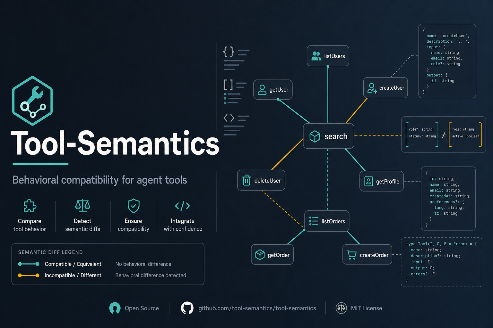
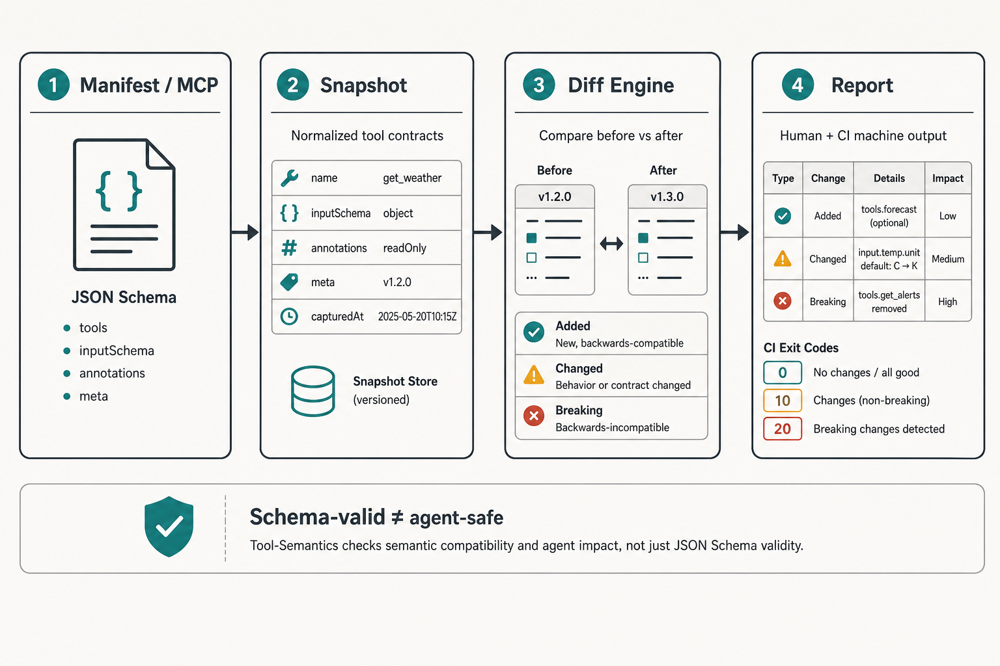
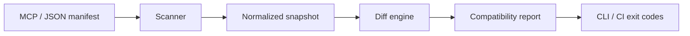
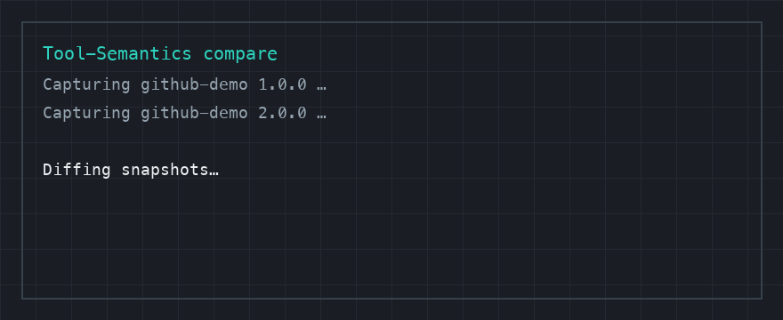

<p align="center">
  
</p>

<h1 align="center">Tool-Semantics</h1>

<p align="center">
  <strong>Know when an MCP change breaks the agent — not just the schema.</strong>
</p>

<p align="center">
  Behavioral compatibility testing for MCP tools and AI-agent interfaces.<br />
  <em>Schema-valid ≠ agent-safe.</em>
</p>

<p align="center">
  <a href="https://github.com/askmy-stack/tool-semantics/actions/workflows/ci.yml"></a>
  <a href="https://www.python.org/downloads/"></a>
  <a href="LICENSE"></a>
  <a href="https://github.com/askmy-stack/tool-semantics/issues?q=is%3Aissue+is%3Aopen+label%3A%22good+first+issue%22"></a>
</p>

---

## Why Tool-Semantics?

AI agents do not call tools the way typed clients do. They choose tools from
**descriptions**, invent **arguments** from schemas, and infer **side effects**
from naming and prose. A change that remains JSON-Schema-valid can still:

- steer the model toward the wrong tool
- drop a required argument the model used to omit
- rename enums the model still emits
- quietly escalate from read-only to write/destructive behavior

**Schema-valid ≠ agent-safe.** Tool-Semantics captures normalized tool-interface
snapshots and evaluates them for structural *and* semantic risk — so teams can
gate MCP and tool-API changes before agents ship broken workflows.

New here? Read the [simple explanation](docs/simple-explanation.md) and
[concepts](docs/concepts.md). Full doc index: [docs/index.md](docs/index.md).

## DETECT · TEST · PROTECT

| | Job | Commands |
| --- | --- | --- |
| **DETECT** | Snapshot interfaces; see what changed | `capture`, `capture-mcp`, `compare` |
| **TEST** | Check tool selection / args / risk expectations | `probe` (offline or `--model`) |
| **PROTECT** | Fail CI when policy says so | exit codes, Action, [config](docs/config.md) |

## Compatibility layers

| Layer | Question |
| --- | --- |
| 1. Protocol | Can the client still speak to the server? |
| 2. Schema | Are parameters and types still valid? |
| 3. Tool selection | Will models still pick the right tool? |
| 4. Execution | Do calls still succeed with prior argument patterns? |
| 5. Intent / side effects | Did risk, confirmation needs, or outcomes change? |

Layers 1–2 are CI-gateable today. Layers 3–5 are covered by offline probes plus
**opt-in** model-backed probes. Live capture supports stdio, Streamable HTTP,
and legacy SSE. See the [roadmap](ROADMAP.md).

## How it works

<p align="center">
  
</p>

<p align="center">
  
</p>


```mermaid
flowchart LR
  A[MCP / JSON manifest] --> B[Scanner]
  B --> C[Normalized snapshot]
  C --> D[Diff engine]
  D --> E[Compatibility report]
  E --> F[CLI / CI exit codes]
```

## Quick start — capture → evaluate

```bash
python -m venv .venv
source .venv/bin/activate
pip install -e ".[dev]"

# 1. Capture baseline and candidate
tool-semantics capture examples/github_server_v1.json -o .tool-semantics/v1.json
tool-semantics capture examples/github_server_v2.json -o .tool-semantics/v2.json

# 2. Evaluate — structural diff + behavioral probes
tool-semantics compare .tool-semantics/v1.json .tool-semantics/v2.json \
  --markdown-output .tool-semantics/report.md
tool-semantics probe .tool-semantics/v2.json \
  --probes examples/probes/github_v1_offline.json

# 3. Protect — non-zero exit fails CI (see docs/github-action.md)
```

A unified `tool-semantics eval` command will combine compare + probes into one
beginner entrypoint ([#76](https://github.com/askmy-stack/tool-semantics/issues/76)).
Until then, use **capture → compare + probe** as the evaluate path.

### Demo

<p align="center">
  
</p>

### Example output

Comparing the included GitHub demo manifests surfaces removals, renames via addition, description drift, and newly required parameters:

```text
Tool-Semantics: 1.0.0 → 2.0.0
┌──────────┬────────────────────────────┬─────────────────────────┬──────────────────────────────────────────┐
│ Severity │ Code                       │ Subject                 │ Change                                   │
├──────────┼────────────────────────────┼─────────────────────────┼──────────────────────────────────────────┤
│ breaking │ tool.removed               │ search_issues           │ Tool 'search_issues' was removed.        │
│ info     │ tool.added                 │ find_work_items         │ Tool 'find_work_items' was added; …      │
│ warning  │ tool.description_changed   │ create_issue            │ Tool description changed; …              │
│ breaking │ parameter.added_required   │ create_issue.repository │ Required parameter 'repository' was …    │
└──────────┴────────────────────────────┴─────────────────────────┴──────────────────────────────────────────┘
Result: breaking
```

## Install (library)

```bash
pip install tool-semantics
# or from source: pip install -e .
```

```python
from pathlib import Path
from tool_semantics.scanner import capture_manifest
from tool_semantics.diff import compare_snapshots
from tool_semantics.report import render_markdown

baseline = capture_manifest(Path("examples/github_server_v1.json"))
candidate = capture_manifest(Path("examples/github_server_v2.json"))
report = compare_snapshots(baseline, candidate)
print(render_markdown(report))
print("compatible:", report.is_compatible)
```

## Exit codes

| Code | Meaning |
| --- | --- |
| `0` | Compatible (no breaking/critical changes) |
| `1` | Breaking or critical changes detected |
| `2` | Input / capture / parse error |

## CLI reference

**Beginner path:** `capture` → `compare` + `probe` (evaluate) → CI protect.

**Advanced / secondary** (linked below): provenance, `--config`, `--model`,
`--trials`, verbose logs, library APIs.

```bash
tool-semantics --version
tool-semantics capture <manifest.json> [-o .tool-semantics/snapshot.json] \
  [--provenance-output snapshot.provenance.json] [-v]
tool-semantics capture-mcp -o snap.json https://example.com/mcp
tool-semantics capture-mcp -o snap.json --http https://example.com/mcp
tool-semantics capture-mcp -o snap.json --sse https://example.com/sse
tool-semantics capture-mcp -o snap.json \
  [--provenance-output snap.provenance.json] -- python my_mcp_server.py
tool-semantics probe <snapshot.json> --probes <probes.json|yaml> \
  [--model] [--trials N] [--seed N] \
  [--json-output report.json] [--markdown-output report.md]
tool-semantics compare <baseline.json> <candidate.json> \
  [--json-output report.json] \
  [--markdown-output report.md] \
  [--config .tool-semantics.toml] \
  [-v]
```

- `--verbose` / `-v` logs paths, tool counts, and change totals to **stderr** (default Rich UX unchanged).
- `--config` loads ignore rules; if omitted, `.tool-semantics.toml` in the cwd is used when present.
- `capture-mcp` speaks MCP JSON-RPC over stdio, Streamable HTTP, or legacy SSE; secrets-like keys are redacted by default. Bare URLs auto-detect HTTP then SSE — see [docs/mcp-versions.md](docs/mcp-versions.md).
- `probe` runs offline behavioral probes by default; `--model` / `--trials` opt into model-backed evaluation (approved probes + API key) — see [docs/probes.md](docs/probes.md).

### Approved baselines and provenance

Capture the approved interface into a Git-tracked baseline. The snapshot is the
contract that `compare` uses; review and commit it when an interface change is
intentional.

```bash
tool-semantics capture examples/github_server_v1.json \
  -o .tool-semantics/baselines/github.json \
  --provenance-output .tool-semantics/baselines/github.provenance.json
```

The optional provenance sidecar records capture context and a digest of the
snapshot. It is separate from the snapshot and never affects compatibility
comparisons.

JSON reports include `changes`, `is_compatible`, and `counts` by severity.

### Docs

| | |
| --- | --- |
| Index | [docs/index.md](docs/index.md) |
| Simple explanation | [docs/simple-explanation.md](docs/simple-explanation.md) |
| Concepts | [docs/concepts.md](docs/concepts.md) |
| Change codes | [docs/change-codes.md](docs/change-codes.md) |
| Architecture | [docs/architecture.md](docs/architecture.md) |
| Config / policy | [docs/config.md](docs/config.md) |
| Probes | [docs/probes.md](docs/probes.md) |
| GitHub Action | [docs/github-action.md](docs/github-action.md) |
| Publishing | [docs/publishing.md](docs/publishing.md) |
| Adapters | [docs/adapters.md](docs/adapters.md) |
| Milestone 7+ plan | [docs/PLAN.md](docs/PLAN.md), [docs/AGENT_EXECUTION.md](docs/AGENT_EXECUTION.md) |

### Optional `risk` field

MCP does not standardize risk. Tool-Semantics accepts an optional tool-level `risk`
value (`read_only`, `external_write`, `destructive`, `unknown`). Missing values
default to `unknown` (no false escalation). See the GitHub demo manifests for
examples.

### Offline probes

```python
from pathlib import Path
from tool_semantics.scanner import capture_manifest
from tool_semantics.probes import Probe, ProbeKind, evaluate_probes

snapshot = capture_manifest(Path("examples/github_server_v1.json"))
report = evaluate_probes(
    snapshot,
    [
        Probe(
            id="search",
            intent="find issues",
            expected_tool="search_issues",
            required_params=["query"],
            kind=ProbeKind.POSITIVE,
        )
    ],
)
assert report.passed
```

## Project layout

```text
src/tool_semantics/   # scanner, models, diff engine, probes, report, CLI
examples/             # demo MCP-style manifests + probe fixtures
tests/                # pytest suite
docs/                 # index, concepts, architecture, change-codes, …
docs/assets/          # README visuals
```

## Roadmap

See [ROADMAP.md](ROADMAP.md) and [docs/PLAN.md](docs/PLAN.md) for Milestone 7+.
Live MCP supports stdio, Streamable HTTP, and legacy SSE
([docs/mcp-versions.md](docs/mcp-versions.md)). Model-backed probes:
[docs/probes.md](docs/probes.md). Downstream consumers:
[docs/downstream.md](docs/downstream.md).

## Contributing

We welcome issues and PRs — especially documentation fixes, tests, and compatibility-rule ideas.

- Read [CONTRIBUTING.md](CONTRIBUTING.md)
- Follow the [Code of Conduct](CODE_OF_CONDUCT.md)
- Browse [good first issues](https://github.com/askmy-stack/tool-semantics/issues?q=is%3Aissue+is%3Aopen+label%3A%22good+first+issue%22)

## Security

Do not auto-execute discovered MCP tools. See [SECURITY.md](SECURITY.md) for reporting guidance.

## License

Apache License 2.0 — see [LICENSE](LICENSE).
