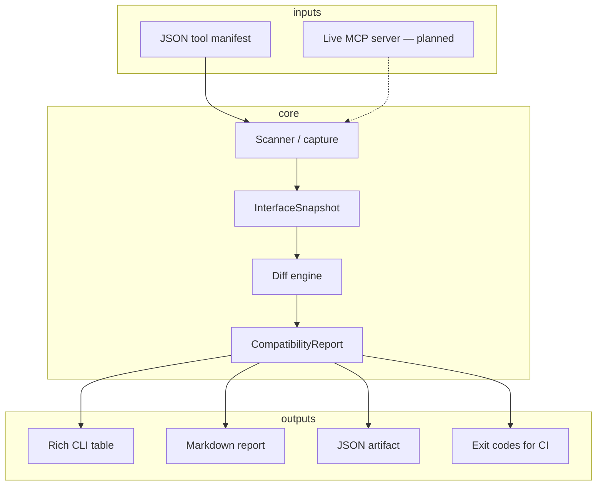

# Architecture

Tool-Semantics separates **transport**, **normalization**, and **compatibility analysis** so the same diff engine can run on static manifests today and live MCP servers tomorrow.

## Pipeline

## Components

| Component | Role |
| --- | --- |
| **Scanner** (`scanner.py`) | Import an interface and emit a versioned snapshot |
| **Models** (`models.py`) | Normalized server metadata and tool contracts |
| **Diff engine** (`diff.py`) | Stable change codes + severity levels |
| **Report** (`report.py`) | Human-readable Markdown / styling helpers |
| **CLI** (`cli.py`) | `capture` and `compare` entry points |
| **Behavioral runner** | Planned model-provider-neutral probe runner |
| **Adapter generator** | Planned compatibility aliases and transforms |

See [change-codes.md](change-codes.md) for the full catalog of stable `Change.code` values.

## Severity model

| Severity | Typical meaning |
| --- | --- |
| `info` | Additive / observational (new optional params, new tools) |
| `warning` | Likely to affect model selection or interpretation |
| `breaking` | Prior clients / argument patterns likely fail |
| `critical` | Elevated risk (e.g. read-only → destructive) |

## Design principles

1. **Deterministic first** — snapshots and diffs must be reproducible without an LLM.
2. **Schema-valid ≠ agent-safe** — description and risk changes are first-class signals.
3. **CI-native** — exit codes and machine-readable artifacts over dashboards.
4. **Untrusted tools** — never auto-execute discovered MCP tools during capture.
