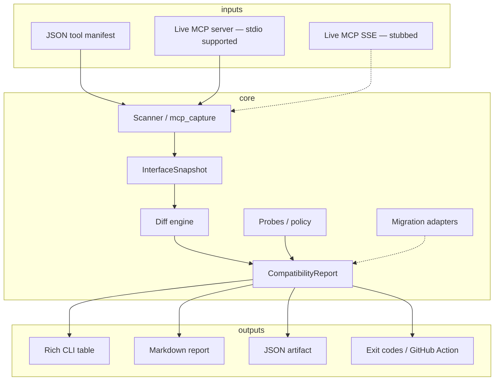

# Architecture

Tool-Semantics separates **transport**, **normalization**, and **compatibility analysis** so the same diff engine can run on static manifests and live MCP servers.

## Pipeline

```mermaid
flowchart TB
  subgraph inputs
    M[JSON tool manifest]
    L[Live MCP server — stdio supported]
    SSE[Live MCP SSE — stubbed]
  end
  subgraph core
    S[Scanner / mcp_capture]
    N[InterfaceSnapshot]
    D[Diff engine]
    P[Probes / policy]
    A[Migration adapters]
    R[CompatibilityReport]
  end
  subgraph outputs
    CLI[Rich CLI table]
    MD[Markdown report]
    JSON[JSON artifact]
    CI[Exit codes / GitHub Action]
  end
  M --> S
  L --> S
  SSE -.-> S
  S --> N
  N --> D
  D --> R
  P --> R
  A -.-> R
  R --> CLI
  R --> MD
  R --> JSON
  R --> CI
```

## Components

| Component | Role |
| --- | --- |
| **Scanner** (`scanner.py`) | Import a static interface / manifest and emit a versioned snapshot |
| **Live MCP capture** (`mcp_capture.py`) | Capture tools over **stdio** MCP (JSON-RPC); SSE is intentionally stubbed |
| **Models** (`models.py`) | Normalized server metadata and tool contracts (`InterfaceSnapshot`) |
| **Diff engine** (`diff.py`) | Stable change codes + severity levels |
| **Probes** (`probes.py`) | Offline behavioral expectations (positive / side-effect / confirmation) |
| **Release policy** (`policy.py`) | Configurable CI gate thresholds for severity |
| **Config** (`config.py`) | TOML/YAML project config (ignore rules, policy overrides) |
| **Migration adapters** (`adapters.py`) | Tool aliases, argument/enum maps, output wrappers |
| **Report** (`report.py`) | Human-readable Markdown / styling helpers |
| **CLI** (`cli.py`) | `capture`, `capture-mcp`, `compare`, and related entry points |
| **GitHub Action** (`.github/actions/compare`) | CI compare + optional PR comment |

### Still planned

- **Model-backed behavioral runners** — LLM-driven probe execution (M4 matrix)
- **SSE live MCP transport** — beyond the current stub
- Broader adapter / matrix automation beyond the shipped declarative adapters

## Related docs

- [change-codes.md](change-codes.md) — stable `Change.code` catalog
- [adapters.md](adapters.md) — migration adapter model and examples
- [adr-live-mcp-capture.md](adr-live-mcp-capture.md) — stdio-first live capture ADR
- [config.md](config.md) — project configuration
- [github-action.md](github-action.md) — composite Action usage

## Severity model

| Severity | Typical meaning |
| --- | --- |
| `info` | Additive / observational (new optional params, new tools) |
| `warning` | Likely to affect model selection or interpretation |
| `breaking` | Prior clients / argument patterns likely fail |
| `critical` | Elevated risk (e.g. read-only → destructive) |

## Design principles

1. **Deterministic first** — snapshots and diffs must be reproducible without an LLM.
2. **Schema-valid ≠ agent-safe** — description and risk changes are first-class signals.
3. **CI-native** — exit codes and machine-readable artifacts over dashboards.
4. **Untrusted tools** — never auto-execute discovered MCP tools during capture.
