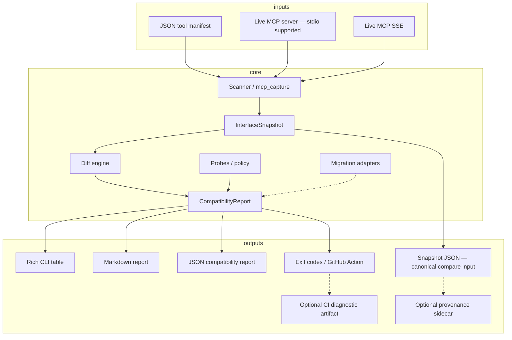

# Architecture

Tool-Semantics separates **transport**, **normalization**, and **compatibility analysis** so the same diff engine can run on static manifests and live MCP servers.

## Pipeline

```mermaid
flowchart TB
  subgraph inputs
    M[JSON tool manifest]
    L[Live MCP server — stdio supported]
    SSE[Live MCP SSE]
  end
  subgraph core
    S[Scanner / mcp_capture]
    N[InterfaceSnapshot]
    D[Diff engine]
    P[Probes / policy]
    A[Migration adapters]
    R[CompatibilityReport]
  end
  subgraph outputs
    CLI[Rich CLI table]
    MD[Markdown report]
    JSON[JSON compatibility report]
    SNAP[Snapshot JSON — canonical compare input]
    PROV[Optional provenance sidecar]
    CI[Exit codes / GitHub Action]
    ART[Optional CI diagnostic artifact]
  end
  M --> S
  L --> S
  SSE --> S
  S --> N
  N --> D
  D --> R
  P --> R
  A -.-> R
  R --> CLI
  R --> MD
  R --> JSON
  R --> CI
  N --> SNAP
  SNAP -.-> PROV
  CI -.-> ART
```

## Components

| Component | Role |
| --- | --- |
| **Scanner** (`scanner.py`) | Import a static interface / manifest and emit a versioned snapshot |
| **Live MCP capture** (`mcp_capture.py`) | Capture tools over **stdio** or **SSE** MCP (JSON-RPC); auth headers never enter snapshot metadata |
| **Models** (`models.py`) | Normalized server metadata and tool contracts (`InterfaceSnapshot`) |
| **Diff engine** (`diff.py`) | Stable change codes + severity levels |
| **Probes** (`probes.py`) | Offline + opt-in model-backed probes, metrics, and stability trials |
| **Model runner** (`runner.py`) | Provider-neutral runner interface + OpenAI-compatible HTTP adapter (no required SDK) |
| **Release policy** (`policy.py`) | Configurable CI gate thresholds for severity |
| **Config** (`config.py`) | TOML/YAML project config (ignore rules, policy overrides) |
| **Migration adapters** (`adapters.py`) | Tool aliases, argument/enum maps, output wrappers |
| **Report** (`report.py`) | Human-readable Markdown / styling helpers |
| **CLI** (`cli.py`) | `capture`, `capture-mcp`, `compare`, and related entry points |
| **GitHub Action** (`.github/actions/compare`) | CI compare + optional PR comment; can upload candidate and reports as a diagnostic artifact |

Snapshots are the canonical JSON inputs to compatibility comparisons and are
normally committed to Git as approved baselines. Capture can also write an
optional provenance sidecar with capture context and the snapshot digest; it is
not part of the snapshot schema or compare input. Optional CI artifacts contain
the candidate snapshot and generated reports for diagnosis only, not a
replacement for Git-tracked baselines.

### Still planned

- Broader adapter / matrix automation beyond the shipped declarative adapters
- Downstream usage-weighted severity (see myelinmesh v0.4 integrations)
- Folding model-backed probe failures into structural reports as `behavior.*`
  change codes ([#61](https://github.com/askmy-stack/tool-semantics/issues/61);
  today metrics live only under [probes.md](probes.md) / [change-codes.md](change-codes.md))

## Related docs

- [change-codes.md](change-codes.md) — stable `Change.code` catalog
- [adapters.md](adapters.md) — migration adapter model and examples
- [adr-live-mcp-capture.md](adr-live-mcp-capture.md) — stdio-first live capture ADR
- [config.md](config.md) — project configuration
- [github-action.md](github-action.md) — composite Action usage

## Severity model

| Severity | Typical meaning |
| --- | --- |
| `info` | Additive / observational (new optional params, new tools) |
| `warning` | Likely to affect model selection or interpretation |
| `breaking` | Prior clients / argument patterns likely fail |
| `critical` | Elevated risk (e.g. read-only → destructive) |

## Design principles

1. **Deterministic first** — snapshots and diffs must be reproducible without an LLM.
2. **Schema-valid ≠ agent-safe** — description and risk changes are first-class signals.
3. **CI-native** — exit codes and machine-readable artifacts over dashboards.
4. **Untrusted tools** — never auto-execute discovered MCP tools during capture.
